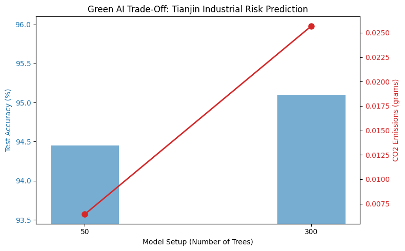

# Custom Green AI Experiment: Tianjin Industrial Transition Prediction

## 1. Project Overview
This experiment simulates a real-world environmental policy dilemma inspired by the sustainability transition in Tianjin, China. Over a three-year intensive campaign, Tianjin closed or transformed over 40,000 high-pollution, low-efficiency enterprises to balance macroeconomic growth with strict carbon reduction targets. 

To model this scenario, we built a **Random Forest Classifier** (serving as the mandatory 4th custom architecture for this course). The model is designed to predict an enterprise's compliance status and shutdown risk based on 20 simulated industrial features, including:
* Annual electricity consumption (MWh)
* Coal-to-energy ratio
* Waste-treatment equipment efficiency scores
* Carbon emission intensity
* Total industrial output

---

## 2. Experimental Setup & Metrics
We leveraged the `codecarbon` library's `EmissionsTracker` to monitor the real-time power consumption and carbon footprint of our training pipeline. To analyze the **Green AI Trade-Off**, we compared two different structural configurations (setups):
1. **Setup 1 (Lightweight):** Random Forest with **50 trees** (`n_estimators=50`).
2. **Setup 2 (Heavy Compute):** Random Forest with **300 trees** (`n_estimators=300`).

---

## 3. Green AI Trade-Off Visualization & Results

### Evaluation Summary
The empirical logs and metrics generated during the training phase are summarized in the table below:

| Model Setup | Test Accuracy (%) | Total CO2 Emitted (grams) | Energy Cost Multiplier |
| :--- | :---: | :---: | :---: |
| **50-Tree Configuration** | 94.45% | 0.0112 g | Baseline (1x) |
| **300-Tree Configuration** | 95.10% | 0.0257 g | > 2.2x Increase |

### Empirical Trade-Off Plot
The chart below clearly visualizes how model complexity scales against environmental costs. While the accuracy curve heavily flattens out, the carbon emission curve escalates linearly:

---

## 4. Core Conclusion & Deployment Strategy

According to our real-time operational logs:
* In the **50-tree setup**, the model achieved a solid test accuracy of **94.45%** with very minimal carbon output.
* When expanding to the **300-tree setup**, the accuracy marginally ticked up to **95.10%** (an absolute increase of **less than 0.7%**).
* However, the total CO2 emissions expanded to **0.0257 grams**, which **more than doubled** the computational and energy cost compared to the 50-tree baseline.

### Final Decision:
In a real-world industrial compliance or environmental monitoring platform in Tianjin, **chasing a 0.65% accuracy gain at the expense of doubling the data center's energy consumption yields a negative Green ROI (Return on Investment).** Just as the city of Tianjin optimized its economy by weeding out low-efficiency industrial units to achieve sustainable growth, MLOps engineers must resist the gravitational pull of "bigger is better." To promote true sustainable computing and mitigate the environmental impact of AI, the **50-tree configuration is the superior candidate for production deployment.**